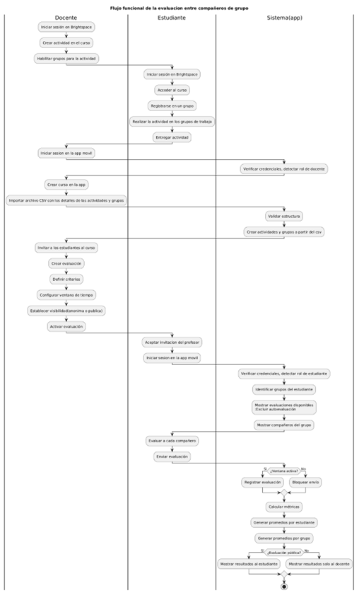

# **PROPUESTA DE SOLUCIÓN**

## **Problema**

Desarrollar una aplicación móvil que permita la evaluación entre compañeros en trabajos grupales

---

## **Análisis de Referente**

### **BrightSpace**

Es un LMS (Learning Management System) desarrollado por D2L (Desire2Learn), ampliamente utilizado por instituciones educativas para gestionar cursos, distribuir contenido académico, asignar y calificar evaluaciones, y realizar seguimiento del progreso de los estudiantes. Funciona principalmente como una plataforma web, aunque también cuenta con una aplicación móvil complementaria.

La aplicación móvil está orientada principalmente al acceso a contenidos, revisión de calificaciones y seguimiento académico general. sin embargo, no ofrece funcionalidades específicas para realizar evaluaciones estructuradas entre pares. Mientras que la versión web sí permite la creación de grupos para distintas actividades y ofrece herramientas como la creación de rúbricas, la configuración de evaluaciones y la calificación de trabajos grupales (casi siempre se asigna una única nota al grupo completo). Además, permite habilitar procesos de evaluación entre estudiantes mediante configuraciones avanzadas, pero estas funcionalidades presentan varias limitaciones frente a la problemática planteada, como lo son:

- No garantiza una evaluación estructurada entre miembros de un mismo grupo, ya que el sistema no está diseñado para una evaluación de desempeño interna de grupos.
- No impide de forma directa y sencilla la autoevaluación.
- No está orientado a medir métricas actitudinales dentro del grupo como puntualidad, compromiso o actitud.
- No automatiza el cálculo de promedios personalizados por estudiante a partir de múltiples criterios, lo que obliga al docente a exportar datos y realizar cálculos manuales.
- No facilita el análisis del desempeño de un estudiante a lo largo de múltiples actividades colaborativas.
- Requiere una configuración técnica muy dificil, que implica el uso combinado de varios módulos y opciones avanzadas.

En conclusión, Brightspace puede abordar parcialmente la problemática al ofrecer mecanismos para que los estudiantes participen en procesos de evaluación de compañeros. Sin embargo, dichas herramientas no están diseñadas específicamente para la evaluación estructurada del desempeño dentro de grupos ya conformados. Esto genera un proceso complejo, limitado en términos analíticos y con una alta carga administrativa para el docente. Por tanto, aunque el referente ofrece una base funcional, no resuelve de manera adecuada las necesidades planteadas en esta propuesta.

---

### **Google Forms**

Es una herramienta de creación de formularios en línea desarrollada por Google, ampliamente utilizada en entornos educativos para recopilar información, aplicar encuestas y realizar evaluaciones sencillas. Permite diseñar formularios personalizados con distintos tipos de preguntas (opción múltiple, escala lineal, respuesta corta, entre otros) y exportar los resultados a hojas de cálculo para su análisis.

En la problemática planteada anteriormente, Google Forms podría utilizarse para que los estudiantes califiquen a sus compañeros mediante un formulario estructurado con los criterios definidos por el docente (puntualidad, contribuciones, actitud y compromiso). Esta solución ofrece flexibilidad en el diseño de preguntas y es de muy fácil de acceso desde dispositivos móviles, pero presenta limitaciones importantes frente a la problemática planteada como:

- No permite gestionar grupos o roles académicos.
- No restringe la evaluación a miembros de un mismo grupo, el docente debería crear un formulario muy extenso con múltiples secciones para cada grupo.
- No impide la autoevaluación.
- No permite actualizaciones automáticas en casos como cuando los integrantes de un grupo cambian
- No automatiza el cálculo de métricas agregadas por estudiante, grupo o actividad por lo que el análisis debe realizarse manualmente en una hoja de cálculo.
- No integra el historial de calificaciones de un estudiante lo que dificulta el análisis del desempeño de un estudiante a través de múltiples actividades.
- No hay una manera de integrarlo de forma directa con Brightspace, lo que implica procesos manuales adicionales como la creación de los cursos y grupos.

Con base a esto Google Forms ofrece una solución flexible y de fácil implementación para recopilar evaluaciones entre estudiantes. Sin embargo, carece de estructura académica, control de roles y automatización de métricas avanzadas. Aunque puede utilizarse como herramienta provisional, no constituye una optima para la evaluación sistemática del desempeño colaborativo en entornos universitarios, sin mencionar todo el esfuerzo manual que debe realizar el docente para aplicar una solución muy limitada.

---

### **Eduflow**

Es una plataforma digital orientada al aprendizaje activo y a la evaluación estructurada entre pares que permite la creación de flujos de trabajo educativos que incluyen entregas, revisión automática entre estudiantes, rúbricas configurables y retroalimentación. Su enfoque está centrado en facilitar procesos de peer review dentro de curso universitarios y programas de formación en línea. La plataforma permite asignar revisiones entre estudiantes de manera automática y gestionar evaluaciones anónimas mediante criterios definidos por el docente. En este sentido, constituye un referente sólido al momento de evaluar a los demas.

No obstante, presenta limitaciones frente a la problemática planteada en esta propuesta ya que su diseño está orientado principalmente a la revisión de las actividades académicas y no al análisis del desempeño colaborativo dentro de los grupos, por lo que el docente debe crear rúbricas con las métricas que quiera evaluar cada vez que quiera hacer una actividad. Ademas, no se integra directamente con la estructura de grupos gestionados en Brightspace, lo que implica procesos adicionales para la creación de los cursos, grupos y los estudiantes. Asimismo, no prioriza el cálculo automatizado de métricas  comparativas por estudiante, grupo y actividad en contextos colaborativos continuos.

En conclusión, Eduflow ofrece una solución robusta para procesos de evaluación entre pares centrados en evaluaciones académicas, pero no está específicamente diseñado para la evaluación sistemática del desempeño colaborativo dentro de grupos institucionales. Por tanto, aunque se aproxima conceptualmente al problema, no lo resuelve de manera optima en el contexto planteado.

---

## **Composición y diseño de la solución**

La solución propuesta consiste de una sola aplicación móvil desarrollada en Flutter, que integrara los roles de profesor y estudiante dentro de un mismo sistema mediante control de acceso basado en roles. Esto con el objetivo de reducir la duplicidad de código, optimizar el mantenimiento de la aplicación y facilitar la escalabilidad. Además, el desarrollo de la aplicación seguirá principios de clean architecture y modularidad.

---

## **Descripción detallada del flujo funcional**

**Enlace a PlantUML:** (Por si no se logra visualizar el diagrama adecuadamente)  
https://www.plantuml.com/plantuml/uml/jLInRXjB3EplArXAmFi2gtX-jlMI54aH0-wfFPvCO--uuUuUai0_bC95a2vDWEZ7mjspSZXBHPgKMivmo1cUBcD2JRdtJUBa2Vxt-K6WouDZ6T13I-0HQ4IViJm13Ka9dFG13rz99HR8NdEGfdcy4MTrUcmktWpi61KYHJvyApIuKjxVfnZGqQQvk5QoChh48xVO5W1vS5cZMFKrxjXpGfrQHmYe21vdmiRajZ7bbl4F5VzpZbeopLdcFUqv9aMDLF1vcEHg1Jr_Hbre5eoNM47JuiRTuKCXR8ilUzJbXESDgJRMpY50BoFxWhtbcAZ7bJskZN17oXqxepYrkGTZUuh_c6eYLvnHgV6qayHIhRexhJbBRMoAFeWMCggxvr7W-lOEdDIrIcVqfZ657kTDxEdJyz8cSpefUaCfK4oQNSgASxvdMW2MD1Chj2NnEBuqQkGwOPs9VaSSv-2EtOzdQN7RsmrrF72nYnCfIomu6JhUPpNmQFrnm9eQKnzgQ37XpfCZAtDakxaowme76RX740XvvzdXkfwFhV9IT7c3Xg5GPkUoG_rUwev1fQCeklcBPp0RLLGCc2RQVAn-YNahzV9X_hPByXo3xMwUH7Fde_EP5J0dMLfzv2x_1loaTUBAjd1heWvRd4ar0NFgrDIb1zp1wkUFk-VyiERmxnhIlRctkZqyhHk0-LDUzY8V2LRlf6Akl7p8L233U7WIgmujTusT2NgNlHNwmvUaxB3SpYiQI55BUZsrB162wDB3yv2Z2zFSstaS28VlvPvEfpyQgXIpJzXQ9rpcDIzo7Xx5Yt7cluFdtMAIq5pQZzpxNm00

**Diagrama**:

---

## **Justificación**

A partir de las entrevistas realizadas a docentes, entre ellos la profesora Katherine Ospino, se evidenció que la implementación de trabajos en grupo es una práctica muy común, ya que se considera que aprender a trabajar en equipo constituye una habilidad indispensable en el entorno laboral. No obstante, también se identificaron múltiples retos y dificultades al momento de desarrollar estas actividades, ya que, en muchos casos no todos los integrantes del equipo aportan o contribuyen de la misma manera pero todos los miembros reciben la misma nota aun cuando algunos no hayan hecho nada, lo que puede ser injusto.

Aunque los docentes pueden esperar que los estudiantes reporten a quienes no trabajaron o implementan estrategias de control como realizar sustentaciones individuales con preguntas específicas para verificar que todos tengan conocimiento sobre el proyecto, se ha comprobado que estas medidas suelen resultar ineficientes porque en muchos casos, no permiten determinar con precisión que tanto aportó cada estudiante dentro del trabajo colaborativo.

Además, durante las entrevistas se evidenció que los docentes no utilizan herramientas específicas que permitan realizar evaluaciones entre grupos ni automatizar el cálculo de métricas, especialmente aquellas relacionadas con aspectos actitudinales. Esto dificulta la obtención de un análisis detallado del desempeño individual en función de criterios como la puntualidad, la actitud, las contribuciones y el compromiso. En este sentido, los profesores manifestaron que sería de gran utilidad contar con una aplicación que facilitara la evaluación entre compañeros, automatizara el cálculo de promedios por estudiante y grupo, y permitiera realizar un análisis semestral detallado basado en métricas específicas.

Por otra parte, el análisis de referentes existentes como Brightspace, Google Forms y Eduflow evidenció que, aunque estas herramientas permiten implementar procesos de evaluación entre pares, ninguna ofrece una solución específicamente orientada a evaluar el desempeño colaborativo interno de los integrantes de un mismo grupo a lo largo de diferentes actividades académicas.

Si bien estas plataformas posibilitan la recopilación de evaluaciones, presentan múltiples limitaciones cuando se busca medir de manera estructurada el aporte individual dentro de un trabajo colaborativo. Entre las principales dificultades identificadas se encuentran la necesidad de configuraciones manuales complejas, la obligación del docente de exportar y procesar datos para realizar cálculos manuales, la ausencia de validaciones automáticas que garanticen que quien evalúa pertenezca al mismo grupo, las dificultades para evitar la autoevaluación y la falta de automatización en el cálculo de métricas agregadas por estudiante, grupo y actividad.

Adicionalmente, la mayoría de estas soluciones están orientadas principalmente a entornos web y no cuentan con una aplicación móvil, lo que limita la accesibilidad, y la comodidad para los usuarios. En este contexto, la propuesta planteada busca ofrecer una solución más específica, automatizada y centrada en la experiencia móvil, orientada directamente a la problemática identificada.

En cuanto a la composición del sistema, la decisión de desarrollar una única aplicación móvil con un sistema basado en roles (docente y estudiante), en lugar de implementar aplicaciones independientes para cada tipo de usuario o combinar aplicaciones móviles con una plataforma web de soporte, se fundamenta en criterios de simplificación arquitectónica, eficiencia en el desarrollo y mantenibilidad del sistema. Una sola aplicación permite reutilizar componentes, centralizar la autenticación y reducir la duplicidad de código, lo que disminuye la complejidad técnica y facilita futuras actualizaciones. Además, el uso de un modelo basado en roles garantiza que cada usuario acceda únicamente a las funcionalidades correspondientes, manteniendo una separación lógica clara sin necesidad de dividir físicamente el sistema en múltiples aplicaciones.

En contraste, desarrollar aplicaciones independientes para cada rol aumentaría el esfuerzo de desarrollo, mantenimiento y sincronización de funcionalidades compartidas, mientras que añadir una plataforma web adicional incrementaría la complejidad estructural sin aportar un valor diferencial significativo, especialmente considerando que ya existen múltiples soluciones web (aunque con limitaciones). Por tanto, la propuesta de una única aplicación móvil con control de acceso por roles representa una alternativa más eficiente, escalable e innovadora.