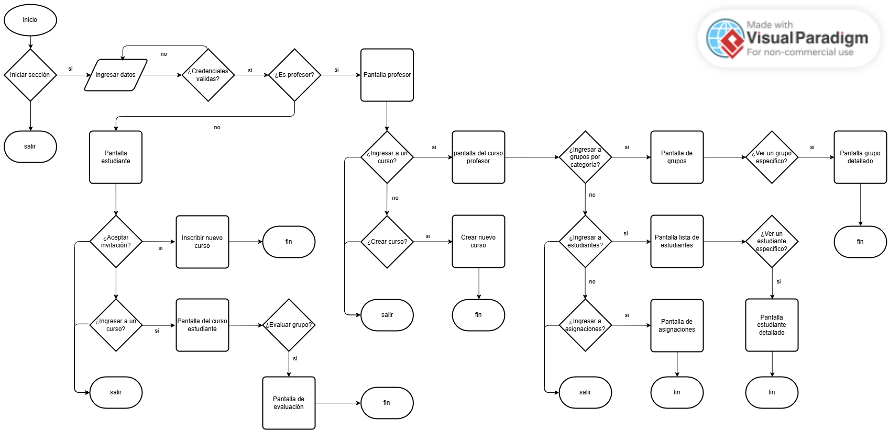

# Contexto del problema

La presente propuesta plantea el diseño de una **aplicación móvil
orientada a la evaluación del desempeño individual dentro de actividades
colaborativas académicas**.

En muchos cursos universitarios, los trabajos en grupo reciben una
calificación única, lo que dificulta identificar el nivel real de
participación de cada integrante. Esta situación puede generar
injusticias académicas, conflictos entre estudiantes y dificultades para
que el docente detecte bajos niveles de compromiso.

La aplicación propuesta permite que los estudiantes evalúen de forma
estructurada y anónima a sus compañeros de grupo, mientras que el
profesor obtiene métricas objetivas que apoyan la asignación de
calificaciones diferenciadas.

# Referentes

### CATME (Comprehensive Assessment of Team Member Effectiveness)

Es una herramienta académica ampliamente utilizada en educación superior para evaluar el desempeño individual dentro de equipos de trabajo. Permite evaluaciones entre compañeros basadas en comportamientos colaborativos y genera reportes que ayudan a los docentes a identificar diferencias en participación y compromiso.

Aporte al diseño: evidencia la necesidad de mecanismos estructurados que permitan al docente obtener información objetiva sobre el funcionamiento interno de los grupos.

### TeamMates (Iowa State University)

Es una plataforma diseñada específicamente para la evaluación entre pares en proyectos grupales. Los estudiantes realizan evaluaciones periódicas y el sistema analiza patrones de participación a lo largo del tiempo.

Aporte al diseño: demuestra el valor de integrar la evaluación colaborativa como parte natural del proceso de trabajo en equipo y no únicamente como una actividad final.

### Peergrade

Herramienta enfocada en la evaluación entre pares, utilizada principalmente para la revisión académica de trabajos y actividades colaborativas. La plataforma permite que los estudiantes evalúen el trabajo de sus compañeros siguiendo criterios definidos por el docente, mientras el sistema organiza y consolida los resultados para facilitar su análisis.

**Aporte al diseño:** valida el uso de evaluaciones anónimas como
mecanismo para reducir sesgos sociales.

# Composición y diseño de la solución

La solución propuesta consiste en el desarrollo de una aplicación móvil única que integra dos tipos de usuario: profesor y estudiante. Ambos acceden a la misma plataforma, diferenciando sus funcionalidades mediante un sistema de roles que habilita distintas acciones según el tipo de usuario autenticado.

Dentro de esta arquitectura, el profesor administra los cursos y activa los procesos de evaluación, mientras que los estudiantes participan respondiendo evaluaciones asociadas a los grupos previamente definidos en el entorno académico institucional. La diferenciación entre usuarios ocurre a nivel de permisos e interfaz, manteniendo una experiencia consistente dentro de la aplicación. Que el proyecto se desarrolle como una aplicación movil permiten un acceso rápido y constante a las actividades de evaluación, facilitando la participación dentro de los periodos definidos por el docente.

La organización general del sistema se estructura alrededor del flujo funcional representado en el diagrama de la propuesta, el cual define la secuencia de interacción entre usuarios, evaluaciones y visualización de resultados.

# Descripción del flujo

#### 1. Inicio de sesión

- El usuario accede a la aplicación mediante sus credenciales.
- El sistema identifica automáticamente si el usuario corresponde a un profesor o a un estudiante.

#### 2. Acceso al curso

- El profesor gestiona los cursos disponibles.
- El estudiante accede a los cursos en los que se encuentra inscrito.

#### 3. Gestión de evaluaciones (Profesor)

- El profesor crea una actividad de evaluación.
- Define la ventana de tiempo durante la cual estará disponible.
- Selecciona la categoría de grupo correspondiente.

#### 4. Proceso de evaluación (Estudiante)

- El estudiante visualiza las evaluaciones activas.
- Evalúa únicamente a los miembros de su grupo.
- El sistema impide la autoevaluación.
- Las respuestas se registran de forma anónima.

#### 5. Procesamiento de resultados

- El sistema consolida automáticamente las evaluaciones realizadas.
- Se calculan los resultados asociados a cada estudiante y grupo.

#### 6. Visualización de resultados

- El profesor accede a un panel donde puede consultar los resultados generales y detallados de cada evaluación.

# Justificación de la propuesta

La propuesta de diseño parte de la necesidad de mejorar la forma en que se evalúa el trabajo colaborativo dentro de contextos académicos, donde la asignación de una única calificación grupal dificulta reconocer el aporte individual de cada estudiante y puede generar percepciones de inequidad.

A partir de esta problemática, las decisiones de diseño se orientan a crear una herramienta que reduzca la carga operativa del docente y, al mismo tiempo, promueva evaluaciones más objetivas y fáciles de implementar dentro del flujo académico habitual.

Una de las decisiones principales consiste en plantear una única aplicación móvil basada en roles, en lugar de sistemas separados para profesores y estudiantes. Esta elección busca simplificar la interacción con la aplicación, disminuir la curva de aprendizaje, mantener una experiencia consistente para todos los usuarios y favorece la adopción de la herramienta en contextos educativos reales.

Asimismo, se propone un sistema de evaluación anónima entre compañeros. Esta decisión responde a la necesidad de minimizar sesgos sociales frecuentes en trabajos grupales, como evaluaciones influenciadas por afinidad personal o acuerdos entre estudiantes. El anonimato contribuye a fomentar respuestas más honestas y representativas del desempeño real.

Complementariamente, los resultados de evaluación se plantean como visibles únicamente para el profesor, con el objetivo de evitar conflictos dentro del grupo y asegurar que la información obtenida funcione como apoyo para la toma de decisiones académicas, y no como un mecanismo de confrontación entre estudiantes.

El diseño del flujo funcional, representado en el diagrama propuesto, prioriza la simplicidad y la claridad de navegación, buscando que la aplicación pueda utilizarse de manera intuitiva sin requerir capacitación previa. Este enfoque responde a principios básicos de experiencia de usuario y coincide con las recomendaciones obtenidas durante la entrevista docente, donde se destacó la importancia de herramientas fáciles de adoptar dentro del aula.

De esta manera, la propuesta se centra en decisiones de diseño orientadas a la usabilidad, la objetividad del proceso de evaluación y la viabilidad práctica de implementación en escenarios educativos reales.

## Prototipo

Enlace al prototipo: _(pendiente)_
