# Soluciones existentes

### •	FeedbackFruits:

Es una plataforma web donde el profesor arma una actividad de evaluación definiendo unos criterios y los estudiantes evalúan a sus compañeros siguiendo esos parámetros. Al final, la herramienta reúne todo y muestra los resultados de forma ordenada para que el profesor los revise.

### •	PeerScholar:

Es una plataforma web, diseñada para que los profesores puedan evaluar a sus estudiantes dentro de un curso. El profesor crea la actividad y escoge el tipo de evaluación que necesita, esta plataforma cuenta con una evaluación clásica, un estudio de caso o una opción de trabajo en grupo. Esta última es la que más se parece a la app que queremos construir, porque está enfocada en equipos y permite evaluar tanto a cada estudiante por separado como al grupo en general.

### •	Buddycheck:

Es una solución web está enfocada en medir el aporte de cada persona dentro del grupo. Los estudiantes califican la contribución de sus compañeros como la participación, responsabilidad, compromiso, etc. y al final el profesor puede ver el resultado de estas mediciones.

# Diseño de la solución

La solución será una sola aplicación móvil donde puedan ingresar ambos roles, a la hora de inicio de sección, la app identifica el rol correspondiente (estudiante/profesor) y según el resultado lo redirige a la pantalla correspondiente de cada rol. La decisión de hacer solo una app es principalmente para evitar escribir de nuevo una funcionalidad que ya está implementada y a su vez esto también evitaría confusiones a la hora de usar la aplicación. 

# Descripción del Flujo

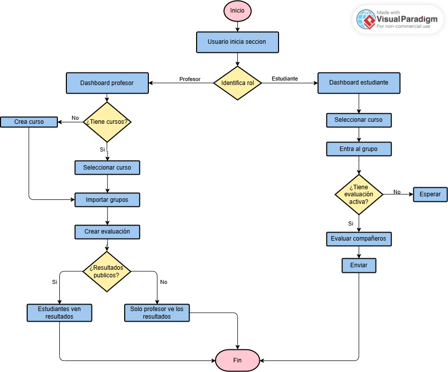

# Justificación

Cada vez que se trabaja en grupo casi siempre aparece el mismo problema, los profesores no pueden saber con total certeza quién trabajó y quién no. En la entrevista realizada con la profesora Katherine, ella nos contó que cuando deja trabajos en grupos, además de la entrega, suele complementar con sustentaciones para asegurarse de que todos hayan participado y entiendan lo que hicieron. También nos mencionó que nunca ha usado una herramienta de este tipo, y que las coevaluaciones pueden fallar por el tema de la amistad, porque a veces se califican bien “para no quedar mal” con el compañero.
En cuanto a las soluciones similares que encontramos, aunque algunas se parecen a lo que buscamos, ninguna cumple completamente con lo que requiere este proyecto. Por ejemplo, varias no permiten que los estudiantes vean sus resultados por actividad, o no le ofrecen al profesor un promedio del desempeño del grupo a lo largo de varias entregas, entre otras funciones.
Por eso se plantea esta solución, un aplicativo móvil intuitivo, pensado para facilitar la coevaluación de los trabajos en grupos y generar datos claros que permitan analizar el desempeño real de cada integrante y del grupo en general. De esta forma, el profesor puede tomar decisiones conscientes a la hora de calificar.
Debido a esta problemática han surgido múltiples soluciones que integran el modelo de evaluación de pares para determinar el desempeño de cada estudiante de manera más efectiva, como Peerceptiv, FeedbackFruits y CATME, de las cuales se adquieren características relevantes para los requerimientos y se integran en la propuesta, como la evaluación anónima, rubrica detallada y analíticas.

# Prototipo

Enlace al [prototipo Figma](https://www.figma.com/proto/uQ2TtKoZOo1ELxeL2dw4DX/Propuesta-de-proyecto?node-id=2-6&p=f&t=Ug1qyR01hZNWZUs8-1&scaling=scale-down&content-scaling=fixed&page-id=0%3A1&starting-point-node-id=2%3A6&show-proto-sidebar=1)

| Inicio                        | Login                                      | Dashboard profesor                                |
| ---------------------------- | ---------------------------------------------- | ------------------------------------ |
| 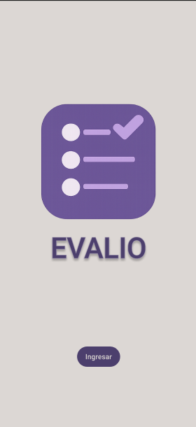 | 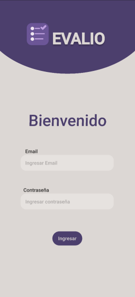 | 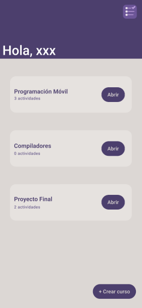 |

| Crear curso                        | Curso                                      | Crear evaluación                                |
| ---------------------------- | ---------------------------------------------- | ------------------------------------ |
| 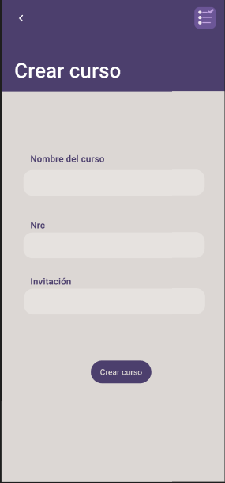 | 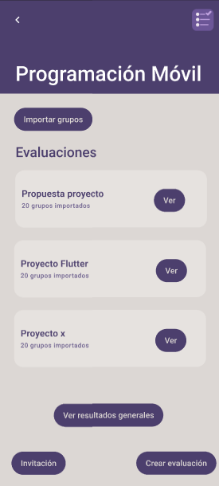 | 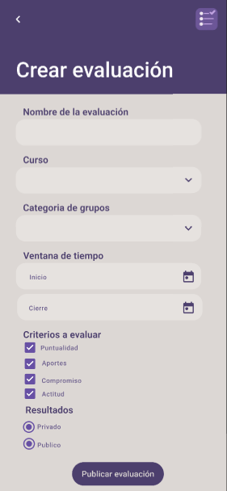 |

| Detalle materia                        | Resultado estudiantes                                      | Resultado grupos                                |
| ---------------------------- | ---------------------------------------------- | ------------------------------------ |
| 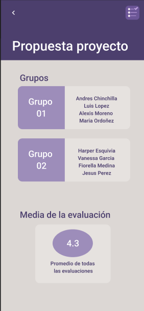 | 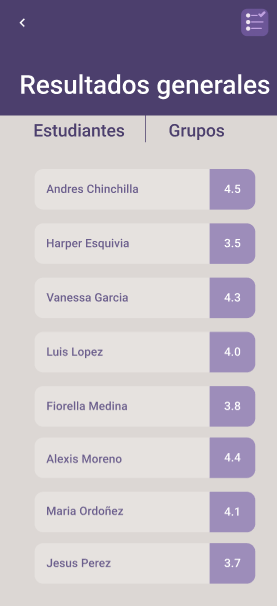 | 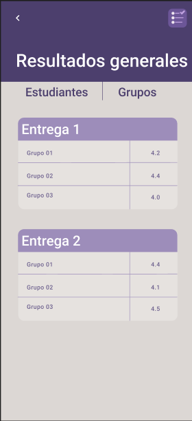 |

| Detalle grupo                        | Dashboard estudiante                                       | curso                                |
| ---------------------------- | ---------------------------------------------- | ------------------------------------ |
| 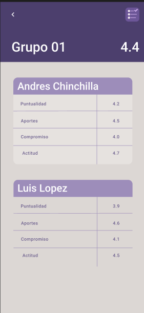 | 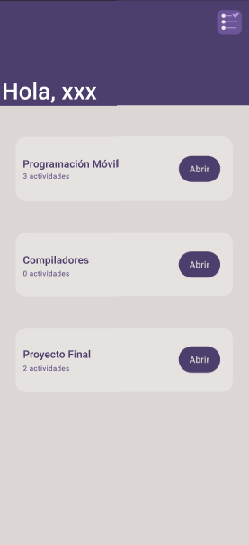 | 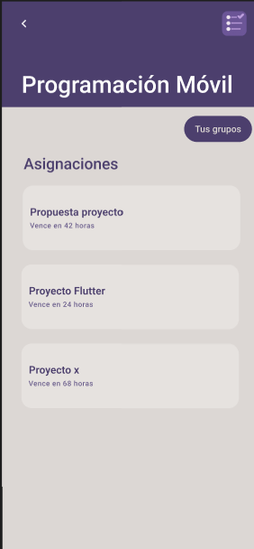 |

| Grupo                      | Calificar                                      | Resultados                                |
| ---------------------------- | ---------------------------------------------- | ------------------------------------ |
| 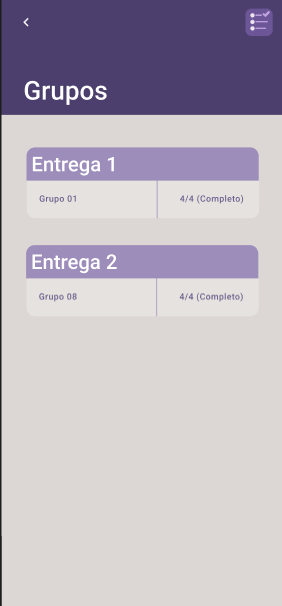 | 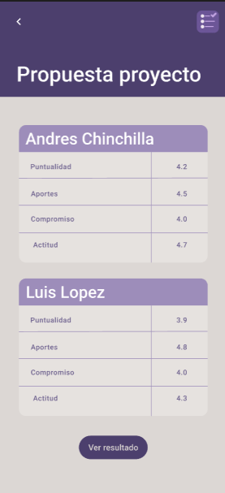 | 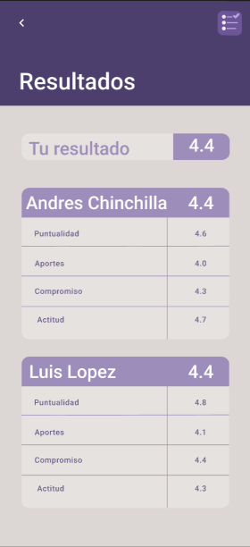 |